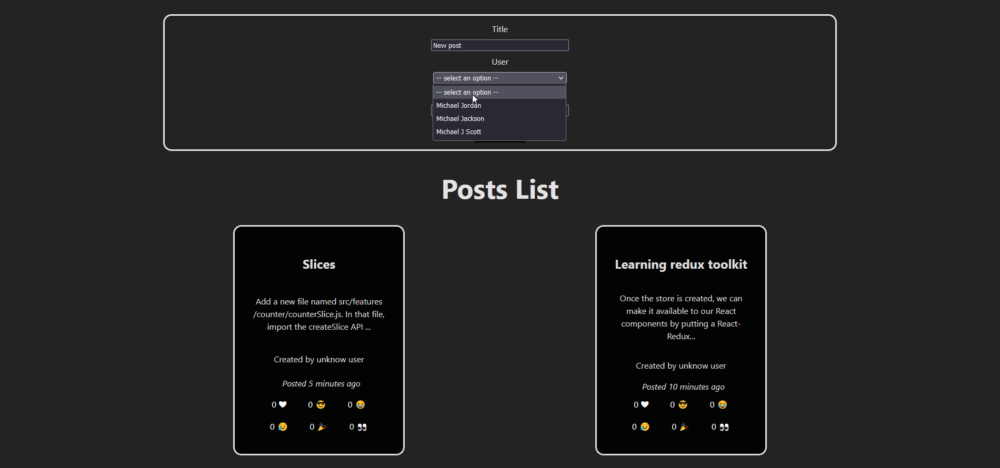

# Learning Redux #

This repository contains a React.js front-end and a Node.js back-end application for post creation app. 
Currently it's possible to retrieve and add posts to the back end through the front-end. Posts consist of: 
- Title;
- Description;
- User;
- Timestamp for when the post was created;
- Buttons for adding reaction to posts (like facebook reactions) and show count.

 

 